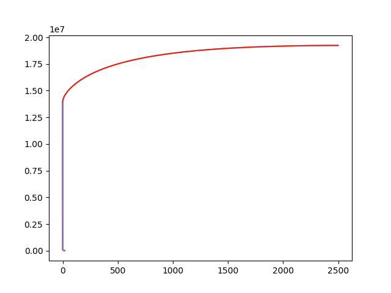
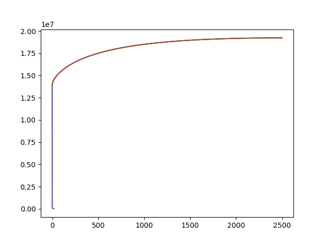

# Singular Value Decomposition

## Comparing Books and Users
For an assignment of ours, we used Singular Value decomposition (SVD) to deconstruct a feature matrix and perform a dimensionality reduction.

We looked at a data set of book reviews where each row corresponds to a given user's rating of a book.  There are approximately 6100 books and 2500 users. We utilized SVD using matrix decomposition in order to reduce the dimensionality of the matrix. Using numpy's SVD method, we get three component matrices (U, Sigma, and V).

By squaring the singular values (Sigma matrix), we can calculate the power.  The power is the variance of each dimension. Total power is the cumulative sum of the power of each singular value.

Here we plot the power of each singular value:

We can see an 'elbow' at around one or two. Meaning the first or second singular values account for a majority of the variance in the data.  The latter singular values account for very little variance in the data.

Here we plot the cumulative sum of the singular values:

By doing this, we can find out how many singular values we need to account for 90% of the variance in the data, which ends up being 441.

## Creating Latent Topics
We can create *n* latent topics by diving into the U and V matrices. We can find what books cluster in each topic.

When we created five latent topics, these are the books that cluster into each topic:

Topic 0: 
Name Der Rose : Umberto Eco 
Monsieur Ibrahim und die Blumen des Koran. : Eric-Emmanuel Schmitt 
Artemis Fowl. : Eoin Colfer 
Novocento, Un Monologo : Alessandro Baricco 
Schlafes Bruder : Robert Schneider 

Topic 1: 
The Red Tent (Bestselling Backlist) : Anita Diamant 
The Lovely Bones: A Novel : Alice Sebold 
The Da Vinci Code : Dan Brown 
Where the Heart Is (Oprah's Book Club (Paperback)) : Billie Letts 
Two for the Dough : Janet Evanovich 

Topic 2: 
Dance upon the Air (Three Sisters Island Trilogy) : Nora Roberts 
Face the Fire (Three Sisters Island Trilogy) : Nora Roberts 
Heart of the Sea (Irish Trilogy) : Nora Roberts 
Jewels of the Sun (Irish Trilogy) : Nora Roberts 
Key of Valor (Roberts, Nora. Key Trilogy, 3.) : Nora Roberts 

Topic 3: 
The Lovely Bones: A Novel : Alice Sebold 
The Red Tent (Bestselling Backlist) : Anita Diamant 
A Time to Kill : JOHN GRISHAM 
The Pilot's Wife : A Novel : Anita Shreve 

Topic 4: 
The Firm : John Grisham 
The Pelican Brief : John Grisham 
A Time to Kill : JOHN GRISHAM 
Silence of the Lambs : Thomas Harris 
The Chamber : John Grisham 

### By reducing the dimensionality of the data frame, it is less computationally expensive to run calculations.  It also makes it easier to compare different books to one another, and we can cluster similar books. 
